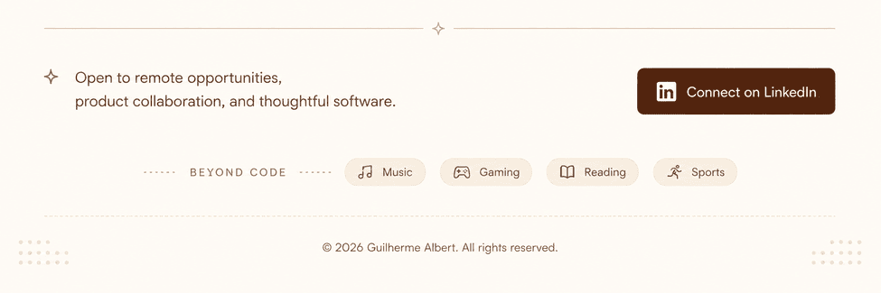

  

<h1 align="center">Guilherme Albert</h1>
<h3 align="center">Senior Software Engineer · AI Engineer · Tech Lead</h3>

  I build <b>AI-first web and mobile products</b> used by real users. 
  12+ years shipping full stack. Currently turning LLMs into reliable infrastructure.

  <code>📍 Brazil · Remote</code> •
  <code>🌎 EN / PT</code> •
  <code>💼 Open to work</code>

  
  
  
  
  

 

## Currently

- Writing about AI engineering, mobile performance and system design at [guilhermealbert.com](https://guilhermealbert.com)

- Building internal tools with LLM workflows, vector stores and RAG pipelines

- Open to remote opportunities with companies that value ownership, impact and engineering quality

## What I do

- **Product Engineering**: End-to-end delivery across backend, frontend and mobile. Performance, observability, scale.

- **AI Engineering**: LLM workflows, vector stores, RAG pipelines and production AI features that don't break in the real world.

- **Technical Leadership**: Clarity. Alignment. Velocity. I lead teams by reducing friction and raising the bar through code reviews and process.

## Technical Arsenal

<table>
  <tr>
    <td width="25%" valign="top">
      

        
        <h3>Frontend & Mobile</h3>
      

      

        React · Next.js 
        React Native · TypeScript 
        Expo · Tailwind
      

    </td>
    <td width="25%" valign="top">
      

        
        <h3>Backend</h3>
      

      

        Node.js · Express 
        Laravel · PHP 
        REST · GraphQL
      

    </td>
    <td width="25%" valign="top">
      

        
        <h3>Infrastructure</h3>
      

      

        AWS · Lambda 
        Docker · Vercel 
        CI/CD · Cloudflare
      

    </td>
    <td width="25%" valign="top">
      

        
        <h3>Data</h3>
      

      

        PostgreSQL · MySQL 
        Redis · MongoDB 
        pgvector · RealmDB
      

    </td>
  </tr>
</table>

## From the blog

<table>
  <tr>
    <td width="50%" valign="top">
      
      <h3>
        <a href="https://guilhermealbert.com/blog/working-with-llms-taught-me-to-run-a-kitchen/">Working with LLMs taught me how to run a kitchen</a>
      </h3>
      
Designing a production-grade workflow engine for LLMs, vector stores, and prompt pipelines. Architecture, trade-offs, and what I'd do differently.

    </td>
    <td width="50%" valign="top">
      
      <h3>
        <a href="https://guilhermealbert.com/blog/react-native-new-architecture">React Native: The New Architecture</a>
      </h3>
      
A deep dive into TurboModules, Fabric, and JSI. How the most significant update to React Native since its inception is changing mobile.

    </td>
  </tr>
  <tr>
    <td width="50%" valign="top">
      
      <h3>
        <a href="https://guilhermealbert.com/blog/ai-agents-future-software">AI Agents and the Future of Software</a>
      </h3>
      
From imperative to declarative systems. How AI agents are changing software architecture, from the ReAct pattern to multi-agent systems.

    </td>
    <td width="50%" valign="top">
      
      <h3>
        <a href="https://guilhermealbert.com/blog/laravel-dev-ecosystem">Laravel and the PHP Renaissance</a>
      </h3>
      
Why ecosystem beats framework. An analysis of how Laravel built one of the most cohesive developer ecosystems in modern web development.

    </td>
  </tr>
</table>

  

