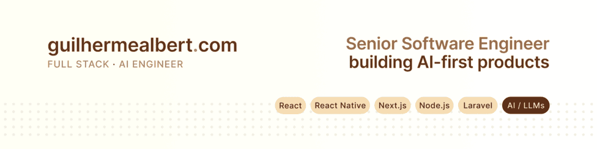

  

<h1 align="center">Guilherme Albert</h1>
<h3 align="center">Senior Software Engineer · AI Engineer · Tech Lead</h3>

  I build <b>AI-first web and mobile products</b> used by real users. 
  12+ years shipping full stack. Currently turning LLMs into reliable infrastructure.

  <code>📍 Brazil · Remote</code> •
  <code>🌎 EN / PT</code> •
  <code>💼 Open to work</code>

  
  
  
  
  

 

## ⚡ Currently

- Writing about AI engineering, mobile performance and system design at [guilhermealbert.com](https://guilhermealbert.com)
- Building internal tools with LLM workflows, vector stores and RAG pipelines
- Open to remote opportunities with companies that value ownership, impact and engineering quality

 

## 💼 What I do

<table>
  <tr>
    <td width="33%" valign="top">
      

        
        <h3>Product Engineering</h3>
      

      

        End-to-end delivery across backend, frontend and mobile. Performance, observability, scale.
      

      

        
        
         
        
        
      

    </td>
    <td width="33%" valign="top">
      

        
        <h3>AI Engineering</h3>
      

      

        LLM workflows, vector stores, RAG pipelines and production AI features that don't break in the real world.
      

      

        
        
         
        
        
      

    </td>
    <td width="33%" valign="top">
      

        
        <h3>Technical Leadership</h3>
      

      

        Clarity. Alignment. Velocity. I lead teams by reducing friction and raising the bar through code reviews and process.
      

      

        
        
         
        
        
      

    </td>
  </tr>
</table>

 

## 🛠️ Technical Arsenal

<table>
  <tr>
    <td width="25%" valign="top">
      

        
        <h3>Frontend & Mobile</h3>
      

      

        React · Next.js 
        React Native · TypeScript 
        Tailwind
      

    </td>
    <td width="25%" valign="top">
      

        
        <h3>Backend</h3>
      

      

        Node.js · Express 
        Laravel · PHP 
        REST · GraphQL
      

    </td>
    <td width="25%" valign="top">
      

        
        <h3>Infrastructure</h3>
      

      

        AWS · Lambda 
        Docker · Vercel 
        CI/CD · GitHub Actions
      

    </td>
    <td width="25%" valign="top">
      

        
        <h3>Data</h3>
      

      

        PostgreSQL · MySQL 
        Redis · MongoDB 
        pgvector
      

    </td>
  </tr>
</table>

 

## 📝 From the blog

<table>
  <tr>
    <td width="50%">
      
        
      <h3>Working with LLMs taught me how to run a kitchen</h3>
      
Designing a production-grade workflow engine for LLMs, vector stores and prompt pipelines. Architecture, trade-offs, and what I'd do differently.

    </td>
    <td width="50%">
      
        
      <h3>React Native: The New Architecture</h3>
      
A deep dive into TurboModules, Fabric, and JSI. How the most significant update to React Native since its inception is changing mobile.

    </td>
  </tr>
  <tr>
    <td width="50%">
      
        
      <h3>AI Agents and the Future of Software</h3>
      
From imperative to declarative systems. How AI agents are fundamentally changing software architecture, from the ReAct pattern to multi-agent systems.

    </td>
    <td width="50%">
      
        
      <h3>Laravel and the PHP Renaissance</h3>
      
Why ecosystem beats framework. An analysis of how Laravel built the most cohesive developer ecosystem in modern web development.

    </td>
  </tr>
</table>

  <a href="https://guilhermealbert.com">
    Read more at <b>guilhermealbert.com</b>
  </a>

 

## 🎯 Beyond Code

<table>
  <tr>
    <td align="center" width="25%">
       
      <b>Music</b> 
      Multi-instrumentalist
    </td>
    <td align="center" width="25%">
       
      <b>Gaming</b> 
      Retro enthusiast
    </td>
    <td align="center" width="25%">
       
      <b>Reading</b> 
      Systems thinking
    </td>
    <td align="center" width="25%">
       
      <b>Sports</b> 
      Gym · Muay Thai · Volleyball
    </td>
  </tr>
</table>

 

## 💬 Let's talk

  Open to remote opportunities with companies building AI-first products or operating with distributed teams.
    
  
  

